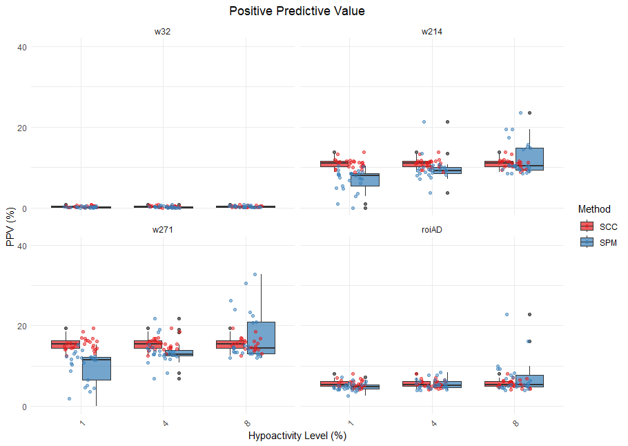

# Simultaneous Confidence Corridors for Single-Patient vs Group Analysis in Neuroimaging

This repository contains the continuation work from our [group vs group analysis](https://github.com/iguanamarina/PhD-2023-SCC-vs-SPM-Group-vs-Group), exploring whether the improved detection capabilities of Simultaneous Confidence Corridors (SCC) over Statistical Parametric Mapping (SPM) are maintained in single-patient vs group comparisons.

The analysis was performed using the same MATLAB and R workflows established in the previous work, adapted for individual patient analysis.

All code is documented to ensure reproducibility. Feel free to use this code to replicate our results or adapt it for your own research. Long live open science!

*Comparative analysis of detection capabilities between SCC (red) and SPM (blue) methods when comparing individual patients against control groups*

